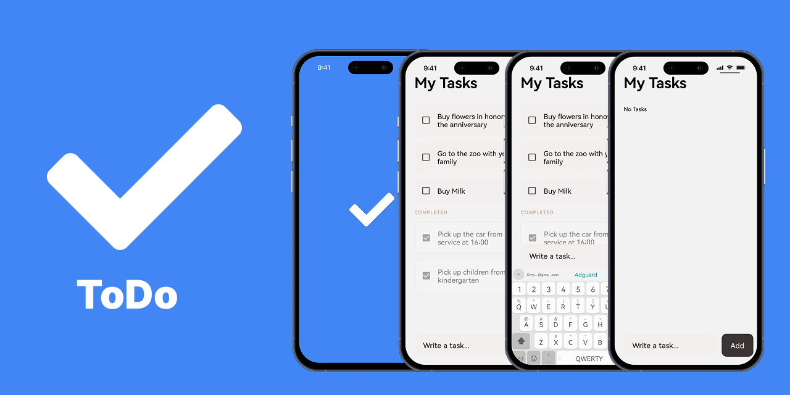

# Добро пожаловать в Todo-приложение 📋

Это простое приложение **Todo**, созданное с помощью [Expo](https://expo.dev) и **React Native**, с поддержкой:

* Локального хранения данных (AsyncStorage)
* Добавления и удаления задач
* Отметки задач как выполненных
* Валидации поля ввода (не допускается пустой ввод)

### 🎥 Демонстрация (GIF)


## 🚀 Как начать

1. Установите зависимости:

   ```bash
   npm install
   ```

2. Запустите приложение:

   ```bash
   npm start
   ```

После запуска вы можете:

* Открыть приложение в [Expo Go](https://expo.dev/go)
* Запустить на Android-эмуляторе или iOS-симуляторе
* Использовать [development build](https://docs.expo.dev/develop/development-builds/introduction/) для полного доступа к нативным возможностям

## 🛠️ Возможности

* 📦 **Хранение данных**
  Все задачи сохраняются в локальном хранилище, чтобы при перезапуске приложения данные сохранялись.

* ➕ **Добавление задач**
  Введите текст и нажмите кнопку "Добавить", чтобы создать новую задачу. Пустые строки не допускаются (валидация).

* ✅ **Выполнение задач**
  Можно отметить задачу как выполненную — она будет перечёркнута.

* 🗑️ **Удаление задач**
  Задачи можно удалять по одному клику.